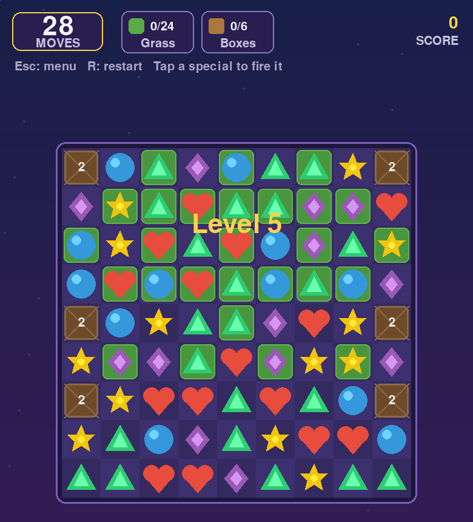

# Royal Match — PC Edition

A Royal Match–style match-3 puzzle game for PC, built with Python and Pygame.
No asset files needed — all graphics are drawn in code and sound effects are
synthesized at runtime.



## Running

Requires Python 3.10+.

```bash
pip install -r requirements.txt
python main.py
```

`numpy` is optional; it only enables the synthesized sound effects.

## How to play

- **Swap** two adjacent pieces (click one then its neighbour, or drag) to make
  a line of 3+ same-colored pieces.
- **Win** by completing every goal in the top bar before running out of moves.
- Bigger matches create special pieces — **tap a special to fire it**, or swap
  two specials together for a combo:

| Match shape | Special | Effect |
|---|---|---|
| 4 in a line | Rocket | Clears the whole row or column |
| 2×2 square | Propeller | Blasts its neighbours, then strikes an obstacle |
| L or T of 5 | TNT | Explodes everything in a radius of 2 |
| 5 in a line | Light Ball | Clears every piece of one color |

Combos: rocket + rocket clears a row *and* column, TNT + rocket clears three
rows and columns, TNT + TNT makes a huge blast, light ball + light ball wipes
the whole board.

## Obstacles & goals

- **Grass** — cleared by matching pieces on top of it.
- **Boxes** — block cells; damaged by matching next to them or by blasts.
  Tough boxes (marked `2`) take two hits.
- Goals can be: collect N pieces of a color, clear all grass, break boxes.

There are 6 levels of increasing difficulty. Progress and best scores are
saved to `save.json`.

## Controls

| Input | Action |
|---|---|
| Left click / drag | Select, swap, tap specials |
| `R` | Restart level |
| `Esc` | Back to level select / quit |

## Development

Game logic (`royal_match/board.py`, `royal_match/levels.py`) is pure Python
and fully unit tested; rendering lives in `royal_match/game.py`.

```bash
python -m unittest discover -s tests
```
